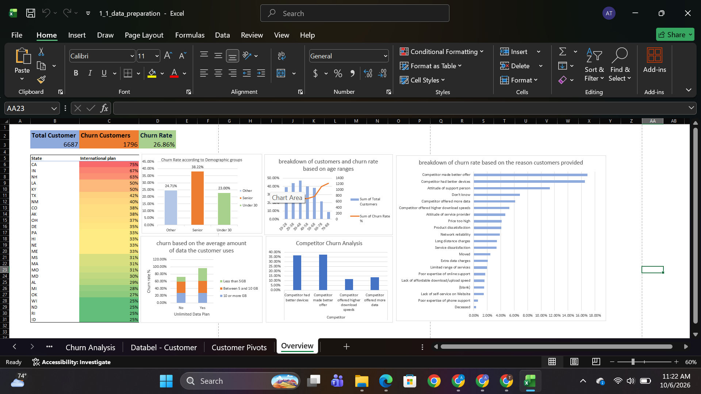

# Databel Customer Churn Analysis

## Executive Summary

This project analyzes customer churn for Databel, a telecommunications company, to identify the primary factors influencing customer retention and cancellations.

Using Excel-based data preparation, PivotTables, calculated fields, and customer segmentation techniques, the analysis evaluates churn patterns across customer demographics, service plans, usage behavior, and competitive factors.

The findings highlight several opportunities for Databel to reduce churn, improve customer satisfaction, and strengthen its competitive position through targeted retention strategies.



## Key Findings

- **Overall churn rate:** 26.86% of customers have churned.
- **Senior customer churn:** Senior customers have a significantly higher churn rate of **38.22%**.
- **Competitive pressure:** A major driver of churn is competition, particularly competitors offering:
  - Better pricing and service offers.
  - More attractive devices and upgrade options.
  - Stronger perceived value for customers.
- **Unlimited Data plan behavior:** Customers on Unlimited Data plans who demonstrate relatively low data usage have elevated churn. This suggests that some customers may not perceive enough value from their current plans.
- **Customer segmentation:** Churn varies across age groups, service usage patterns, and plan types, emphasizing the need for targeted rather than one-size-fits-all retention campaigns.

## Data Modeling Techniques

The analysis used the following data modeling and analysis techniques:

- **Excel PivotTables**
  - Summarized churn by customer demographics, plans, usage, and churn reasons.
  - Compared churn rates across customer segments.
  - Identified patterns in customer behavior and service usage.

- **Calculated Fields**
  - Calculated overall and segment-level churn rates.
  - Compared churned and retained customer populations.
  - Derived performance metrics to support business insights.

- **Binned Age Groups**
  - Grouped customers into meaningful age categories.
  - Enabled comparison of churn behavior across different life-stage segments.
  - Helped identify senior customers as a high-risk retention segment.

## Strategic Business Recommendations

### 1. Develop a Senior Customer Retention Program

Since senior customers experience a churn rate of **38.22%**, Databel should introduce dedicated retention initiatives, including:

- Simplified plan options and billing communications.
- Personalized customer support for service and device issues.
- Loyalty discounts or long-term customer benefits.
- Proactive outreach before contract or promotional periods expire.
- Device education and upgrade assistance.

### 2. Strengthen Competitive Positioning

Competitor-driven churn indicates that customers are responding to better offers and devices elsewhere. Databel should:

- Review pricing and promotional offers against major competitors.
- Introduce targeted win-back offers for customers considering cancellation.
- Improve device upgrade programs and financing options.
- Communicate the value of Databel’s network, services, and customer support more clearly.
- Monitor competitor promotions on an ongoing basis.

### 3. Optimize Unlimited Data Plans

Customers with Unlimited Data plans but low usage may not see sufficient value in their current plans. Databel should:

- Identify customers whose usage is consistently below the plan’s value threshold.
- Offer lower-cost or right-sized plans that better match actual usage.
- Provide personalized plan reviews through customer service and digital channels.
- Use usage alerts and plan recommendations to increase transparency.
- Promote additional benefits, such as hotspot data or entertainment services, where appropriate.

### 4. Implement Proactive Churn Monitoring

Databel should create an early-warning retention process using indicators such as:

- Declining usage.
- Repeated service complaints.
- Contract or promotion expiration.
- Competitor-related dissatisfaction.
- Low engagement with plan benefits.
- Recent device or billing issues.

High-risk customers can then receive timely, personalized interventions before they churn.

### 5. Use Segment-Based Retention Campaigns

Retention strategies should be tailored to customer needs rather than applied uniformly. Databel can improve campaign effectiveness by segmenting customers based on:

- Age group.
- Current plan.
- Usage behavior.
- Tenure.
- Churn reason.
- Device ownership and upgrade eligibility.

## Project File Directory

```text
databel-customer-churn-analysis/
├── 1_1_data_preparation.xlsx
└── assets/
```

## Conclusion

The analysis shows that Databel’s churn problem is driven by a combination of customer demographics, competitive offers, device expectations, and plan-value perception.

By focusing on senior customers, improving competitive offers, optimizing Unlimited Data plans, and introducing proactive, segment-based retention campaigns, Databel can reduce churn and improve long-term customer loyalty.
